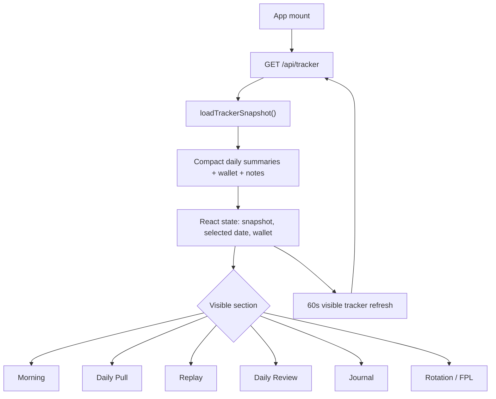

# Rubicon Code Loop Sanity

> Point-in-time source-code audit. This file preserves findings from the date below and is not the current codebase map. For current orientation, read `codebase.md` and `detailedcodebase.md`; for current status, read `WORKLOG.md`, `naive_acceptance.md`, and `naive_validation.md`.

Date: 2026-06-02

Scope: source-code-only pass. This audit did not open `data/`, sibling `IBKR Equity History Pull` archives, large JSON files, or CSV artifacts. Evidence came from `src/`, `server/`, `scripts/`, and project docs.

## Global Loop



Baseline sanity:
- The startup hot path is supposed to stay on `/api/tracker`, compact daily summaries, wallet, and local notes.
- Replay detail and row-level chart payloads should only load when a replay/review surface needs them.
- Data-changing actions should invalidate or refresh the relevant compact state.

## Morning

Loop:
1. `App` sets `morningDate` to Eastern today while tracking today.
2. `MorningDashboard` calls `fetchMorningBrief(selectedDate)`.
3. `/api/morning` calls `loadMorningBrief(date, appRoot, { refresh })`.
4. Normal reads prefer `data/morning-brief-state/YYYY-MM-DD.json`.
5. Manual `Refresh Morning` and the once-per-day `08:30` ET auto refresh call `refresh=1`, pulling live Morning sources and rewriting saved state.
6. Live updates poll separately through `/api/morning/live-updates` every 10 seconds.
7. Holdings, AI notes, Godel watcher, and Godel bridge have separate endpoints.

Sanity:
- Good: Morning brief no longer needs to hit live calendar sources on every normal poll.
- Good: Live squawks are isolated from the full brief refresh path.
- Good: The 08:30 ET Morning refresh records the auto marker only after a successful auto refresh.
- Watch: Godel watcher/bridge status polling runs every 5 seconds while Morning is mounted. This is small JSON/status work, but still a frequent loop.
- Good: Morning `spreadSpeed` still fetches `/api/spread-speed` for `morningDate`, but that endpoint is now sidecar/state-only and cannot reopen the giant upload payload.

## Daily Pull / Sync

Loop:
1. Daily Pull reads from the tracker snapshot and `/api/daily-sync/status`.
2. `Run Daily Sync` posts to `/api/daily-sync/run`.
3. `startDailySync()` launches the PowerShell wrapper.
4. On successful completion, `refreshDailySyncDerivedState()` refreshes:
   - compact tracker summary,
   - replay safe state,
   - saved Morning state for the completed summary date.
5. App polling keys completed syncs by `finishedAt|latestSummaryDate` and refreshes tracker state once per new completion.

Sanity:
- Good: Failed sync exits do not refresh derived state.
- Good: Regular status polling and active-running polling both notice completion.
- Good: Tracker state uses compact summaries rather than giant upload payloads.
- Watch: Sync completion waits for derived-state refresh work before the final status write. That is acceptable, but if live Morning sources are slow, the final status can lag by those source timeouts.

## Replay

Loop:
1. Replay payload is fetched only when Replay or Daily Review needs replay data.
2. Frontend calls `/api/replay?date=...&tradeId=...`.
3. Server defaults to safe mode unless `full=1`.
4. Safe mode uses `rubicon_replay_safe_state.json` or builds it from sidecar CSV candidates without falling back to `google_sheet_upload_payload.json`.
5. Full mode can still load complete row-level marks, volume, open interest, and SPX bars.

Sanity:
- Good: The HTTP route defaults to safe replay mode.
- Good: Safe replay state explicitly avoids the giant upload payload for SPX bars.
- Watch: Full replay mode remains a heavy explicit path. It should stay operator-only/debug-only unless row paging/downsampling is added.

## Spread Speed

Loop:
1. `App` fetches selected-date spread speed only in the Replay cockpit.
2. `App` also fetches Morning spread speed for `morningDate`.
3. `/api/spread-speed` calls `loadSpreadSpeed(date, { refreshSafeState })`.
4. `loadSpreadSpeed()` reads `rubicon_spread_speed_state.json` when its sidecar source mtimes still match.
5. State rebuilds use `loadSafeSpxBars(date)` plus option-leg sidecar CSV candidates only.
6. Stale `full` callers are kept on the safe-state path; Spread Speed no longer imports the payload-fallback `loadSpxBars()` loader.

Sanity:
- Good: Missing SPX sidecars now produce an unavailable payload instead of falling back to `google_sheet_upload_payload.json`.
- Good: Daily sync refreshes the saved Spread Speed state through the same sidecar-only path.
- Good: The regression test covers both normal callers and stale `mode: "full"` callers without touching real archive files.

## Daily Review

Loop:
1. Daily Review uses tracker trades, selected daily summary, review notes, flags, and replay-safe payload when chart context is needed.
2. Review note saves post to `/api/review-note`.
3. Server writes local review notes and invalidates tracker cache.

Sanity:
- Good: Core review metrics are computed from in-memory tracker snapshot state.
- Good: Review note writes are small local JSON writes.
- Watch: Any chart path that asks for full replay should be kept explicit; the current `/api/replay` route default is safe.

## Journal

Loop:
1. Journal state is kept in browser local storage.
2. App mirrors journal entries to `/api/trade-journal-snapshot`.
3. Server writes a compact JSON snapshot for automation/AI notes.

Sanity:
- Good: No large market-data reads are needed for normal journal editing.
- Watch: This is client-local-first state; browser storage loss would remove drafts unless the server snapshot has enough data for recovery.

## Rotation / RRG

Loop:
1. Rotation calls `/api/rrg/bars`.
2. Server reads app-local `data/tc2000-daily-bars.json`.
3. UI selects a readable subset of symbols and renders relative rotation.

Sanity:
- Good: It reads a compact app-local JSON export, not the trade archive.
- Watch: If TC2000 symbol count grows materially, add a server-side summary/downsample. Current shape is small compared with tracker/replay artifacts.

## FPL Indicator

Loop:
1. FPL panel loads manifest through `/api/fpl-indicator/manifest`.
2. It loads selected predictions through `/api/fpl-indicator?date=...`.
3. Live status polls `/api/fpl-indicator/live/status`; when live is running, the UI refreshes manifest/payload.
4. Server serves prediction CSV files from the FPL predictions folder.

Sanity:
- Good: Manifest gates payload fetches so the panel does not ask for unavailable dates.
- Watch: Live mode intentionally polls and reloads the current prediction CSV. This is probably fine for per-bar predictions, but if prediction files grow large, add tail/incremental serving.

## Source-Health / Admin Actions

Loop:
1. Google snapshot refresh posts to `/api/google-snapshot/refresh`, then tracker cache is invalidated.
2. IBKR wallet refresh posts to `/api/ibkr-wallet/refresh`, then tracker cache is invalidated.
3. IBKR holdings refresh is separate Morning state.
4. Desktop launcher restarts stale server processes and verifies `/api/health`.

Sanity:
- Good: Refresh actions invalidate compact tracker state.
- Good: Holdings auto-refresh is scheduled around `08:30` ET independently of Morning brief state.
- Watch: Multiple overlapping manual refreshes can still compete for user attention. The backend generally coalesces the known expensive tracker path, but not every side endpoint has coalescing.

## Top Findings

1. Fixed in A131: `/api/spread-speed` no longer reaches the giant upload payload through `loadSpxBars()` when SPX sidecar CSVs are missing.
2. Full replay mode remains intentionally heavy and should stay explicit.
3. The giant markdown docs do not affect runtime, but `WORKLOG.md` is large enough that agents should skim only the top/current section.

## Suggested Next Fix

Keep the same rule for any new row-level Rubicon surface:

```text
normal UI load
  -> saved state / compact summary
  -> sidecar-only rebuild on explicit refresh or sync completion
  -> no fallback to giant upload payloads
```

That keeps the expensive artifacts as audit/raw-detail inputs, not normal query inputs.
